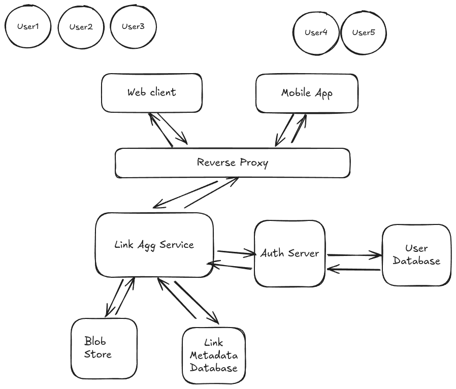
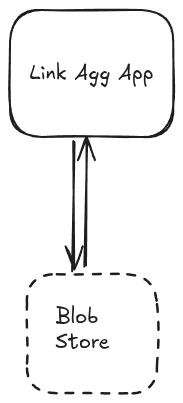

# Here begins your Linkleaf journey

Hello fellow internaut! This book is an introduction to the use of the Linkleaf apps and library. But in another way it is a step toward to reclaiming your user data sovereignity, to create your little corner of the web, to grow your knowledge base, to share this with family, friends and colleagues.

## How it began

Unsurprisingly enough I didn't build Linkleaf to show off or monetise on it. I built it, because I felt I needed it.
About one year ago I used [Omnivore]() pretty much every day. Unfortunately the app was retired. I found myself looking for alternatives. I know that there are plenty. Commercial and not.
I didn't want to pay for it, because let's face it, saving a bunch of links and share them across platforms, it's not a service worth paying for.
The non Commercial solution involved running my own server. I guess at some point I will have a home server, but setting it up for using such a service seemed like overkill.
But looking for a cheap (ideally free) and easy solution got me thinking: why would we need a server for this? The only reason would be to synchronize data across multiple devices. But a server is not the only thing that can do this.
In fact I would argue, that for the case of personal use, having a server to connect to in order to store some links, might be a very bad and overengineered design.

## Why are cloud services so expensive
It's no surprise that companies try to turn a profit. But it's true that even for a small application like saving your links somewhere for you to retrieve at a later point, the costs are considerable.
Let me illustrate my point:

In the image you can see that this architecture has different components:

- **The Web Client and the Mobile app**: This represent the Front End of the application. Usually Web Client and Mobile app are developed by developers with different skills.
- **The Reverse Proxy (e.g. nginx)**: The Reverse Proxy maps the Front End requests to the backend service, act as a filter against DDOS attacks, etc.
- **The Link Agg service**: This is where the core functionality of your service lies.
- **The Auth server**: It authenticates and authorizes the users. Manages sessions, token expiration, etc.
- **The User Database**: Where the User data is stored.
- **The Blob store**: a place where the Feed binaries are stored.
- **The Link Metadata Database**: It contains metadata relative to the links

This is an oversimplified version of a real world architecture. It doesn't take into consideration scaling, performance, monitoring, further data aggregation, more complex interactions with other internal and external systems (e.g. payments), etc.

All those things are necessary because having more users and untrusted actors it is necessary to implement safeguards.

This is what a single user actually needs:

But here is the kick. Even if you deploy your own app to be used just from you to a server, you are going to end with a lot of different moving pieces that have nothing to do with saving and updating links (even though probably cheaper and simpler than the "Commercial" Architecture).

The key reason is: ever if a single server is cheaper and simpler than a cloud based service, **it still is very expensive** depending on what you need that server for.

## Enter Linkleaf
The closest we can get of that simple Architecture for one User is with a Local First App.

**Linkleaf** is not opinionated when it comes to your storage solution.
Do you just want to use **Linkleaf** offline? Just Download the app for your device and you are ready to go. No user account required.
If you want to sync your Feed across multiple devices you have some options.

### Save your Feed in Google Drive, Dropbox, etc.
(TODO)

### Sync with a remote git repository
(TODO)

### Save your Feed to a S3 Bucket
(TODO)

### Build your own App
(Use the library)
